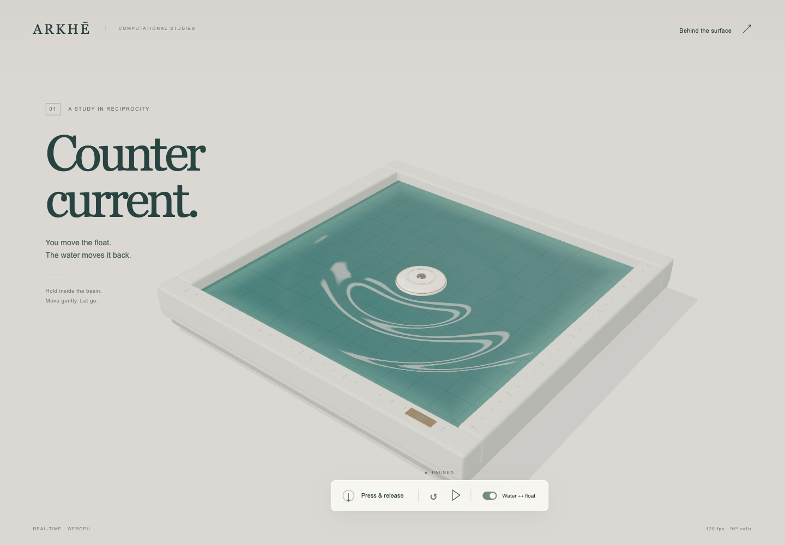

# Countercurrent

An ARSENAL water-and-float study by Arkhē, built with Astra in Codex.

[Open the live experiment](https://www.xn--arkh-eva.org/countercurrent/) · [Model](MODEL.md) · [Evidence](PROOF.md) · [ARSENAL releases](https://www.xn--arkh-eva.org/open-source#countercurrent)

Press the ivory float, guide it across the basin, and release it. Its vertical motion puts pressure into a live shallow-water field. That same field changes the float's force. Open **Behind the surface** to inspect the fields, read the model, or run a CPU/GPU comparison on your device.



[Watch the 18-second demo](docs/assets/countercurrent-demo-v2.mp4) · [Earlier uncut validation recording](docs/assets/countercurrent-uncut.mp4)

This is a separate ARSENAL study following [The Cove and cloth-v1 first drop](https://github.com/AdemVessell/arsenal-first-drop), with new reference code, GPU compute, interaction and presentation. Its contribution is an inspectable reciprocal coupling with reproducible checks: potential derivatives, numerical invariants, CPU/GPU correspondence and deliberate implementation failures. It is a bounded heave model, not a calibrated floating hull or general fluid simulator. See [MODEL.md](MODEL.md) and [PROOF.md](PROOF.md).

## Run

Use Node 20.19+ or 22.12+ and a WebGPU-capable browser on a secure origin (HTTPS or localhost).

```sh
npm ci
npm run dev
```

Open `http://127.0.0.1:5188/`. Dependency installation needs the package registry. The installed app has no remote assets, telemetry, API key or runtime service.

```sh
npm run check
npm run preview
```

The production output is `dist/`, with relative asset paths for subdirectory hosting. `npm run preview` serves it at `http://127.0.0.1:4188/`. This repository does not include `node_modules` or built bundles. Plain `file://` is not a supported launch method.

## Try the experiment

- Hold inside the basin and move gently. Release to stop applying hand force.
- **Press & release** provides the same vertical input without pointer dragging.
- Pause/resume and reset are available at the bottom. Keyboard shortcuts: Space, R and C, when focus is outside a button or link.
- To compare disconnected behavior, turn **Water ↔ float** off, reset, and press. Existing waves continue if you disconnect without resetting.
- The field notes provide surface, height, flow and top views. Height colors saturate at ±5 mm; measurements retain the full range.
- The GPU/reference button executes three small cases; it does not display a prerecorded PASS.

Reduced-motion preference disables the opening demonstration. Inactive tabs stop advancing. A limited catch-up budget drops wall time during overload instead of taking a larger numerical timestep. Unsupported WebGPU shows an explanatory screen with the model still accessible; `?forceFallback=1` exercises that route.

## What the model does

A normalized compact footprint both senses and presses the water. A shared quadratic potential supplies the two reciprocal derivatives. A reflecting MAC grid and kick–drift update give a small executable numerical contract. Water is fp32 on the GPU; the sampled presentation texture is fp16. Float heave is read directly from GPU state by its vertex material.

The hand and horizontal guide are external work. The heave coordinate is an incremental model around a subtracted equilibrium, with signed incremental pressure. It does not solve displacement, wetting, full rigid-body motion, splash, breaking waves or calibrated hydrodynamics. Optical slopes are amplified ×3 for readability; geometry and measurements keep scale 1. Procedural tile refraction and studio-light reflections are illustrative.

## Evidence and contribution

GitHub Actions runs the nine CPU test groups, production build and runtime audit. GPU correspondence is a separate browser check: run it from **Behind the surface**. Published results identify the tested grid sizes, tolerances and limits.

[PROOF.md](PROOF.md) maps each claim to a runnable check and its limits. [evidence/DEVELOPMENT.md](evidence/DEVELOPMENT.md) retains the initial test blind spot and rendering defect. [interface.md](interface.md) records field ownership and units. [ASSETS.md](ASSETS.md) records dependency and visual provenance. The short demo is a contiguous 18-second excerpt (7–25 s) from a fresh 35.56-second browser recording, with visible water motion from the start, guided dragging, release and reset. It replaces an earlier clip with a long idle opening. [evidence/MEDIA_CHECK.json](evidence/MEDIA_CHECK.json) records the capture and frame checks. The earlier 109.6-second validation recording is also retained. Neither recording contains generated or composited simulation footage.

Stevenson selected and directed the project. Astra authored and integrated this successor in Codex; a separate model advised on the mathematics and a read-only adviser located the release route. This is an attributed build record, not a controlled model comparison or a scientific-novelty claim. Earlier ARSENAL results are not presented as new Astra results.

## License

Source and documentation use Apache-2.0, following ARSENAL's existing public-release policy. See [LICENSE](LICENSE), [LICENSE_SCOPE.md](LICENSE_SCOPE.md) and [THIRD_PARTY_NOTICES.md](THIRD_PARTY_NOTICES.md). Project names and branding carry no trademark grant. Screenshots and demo recordings have the separate demonstration-use boundary stated in LICENSE_SCOPE.md.
